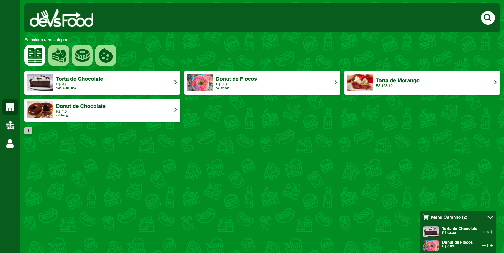

<h1 align="center">devsFood</h1>
<h3 align="center">
  Website layout using React JS, just for training.
</h3>

<h4 align="center"> 
	 Status: Under Construction
</h4>

## Layout

### Web

<p align="center" style="display: flex; align-items: flex-start; justify-content: center;">
  
</p>

#### Running the web application (Frontend)

```bash

# Clone this repository
$ git clone https://github.com/YukioVN/B7-Devs-Food.git

# Access the project folder in your terminal
$ cd B7-DEVS-FOOD

# Install the dependencies
$ yarn install

# Run the application in development mode
$ yarn run start

# The application will open on the port: 3000 - go to http://localhost:3000

```

---

## Tech Stack

The following tools were used in the construction of the project:

#### **Website**  ([React](https://reactjs.org/)

-   **[React Router Dom](https://github.com/ReactTraining/react-router/tree/master/packages/react-router-dom)**
-   **[Styled-components](https://github.com/styled-components/styled-components)**
-   **[React Redux](https://github.com/reduxjs/react-redux)**
